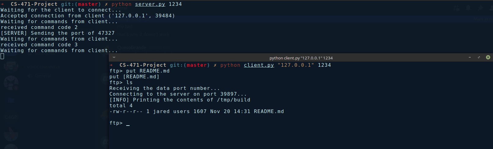
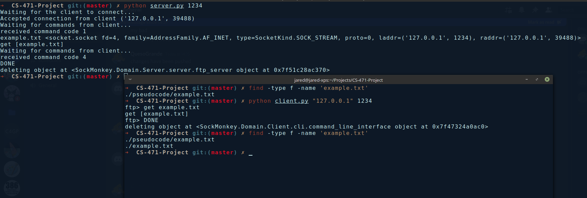
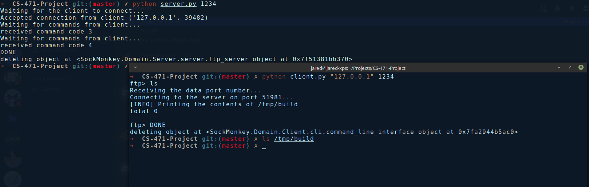

# CS-471-Project

Contributors:
- Jared Dyreson    --  jareddyreson@csu.fullerton.edu
- Mark Gonzalez -- mgon025@csu.fullerton.edu
- Favian Velazquez -- chivista008@csu.fullerton.edu
- Matthew Padden   --  Paddenmatt@csu.fullerton.edu
- Maria Medina -- rosemary98@csu.fullerton.edu

# Summary

- This program is client server program that provides a simple FTP application
- It has the ability to:
    * List files in a remote file system
    * Retrieve (`get`) a file from a remote file system
    * Upload (`put`) a file on the local file system onto the remote file system

# Directories Used

- Client
    * This directory (CS-471-Project)
- Server
    * /tmp/build
    * This directory will be created by the server if it does not exist.

# How to Run

- This program should be run using two separate terminal applications
    * First, run the server application by typing `python server.py <PORT NUMBER>`
    * The "PORT NUMBER" is the port where the server will bind to and **must** be non-negative
    * In the second terminal window, run the following command `python client.py "127.0.0.1" <PORT NUMBER>`, and both port numbers **must** be the same
    * "127.0.0.1" is the IP address of `localhost` and this is how all traffic is routed. 
    * This can be applied to running the server on a separate machine  and the client can connect to it over the internet.
    * The client will then bind to the sever instantiated in the previous steps
    * You now have access to the following commands with their arguments:
        + ls
        + put [filename] (must be present on local file system)
        + get [filename] (must be present on remote file system)
        + help
        + quit

# Usage

Here cases of example usage.

## Put

## Get

## List

